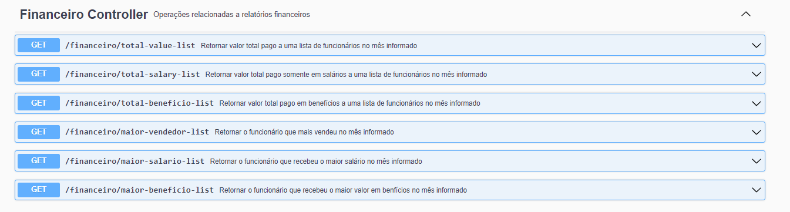
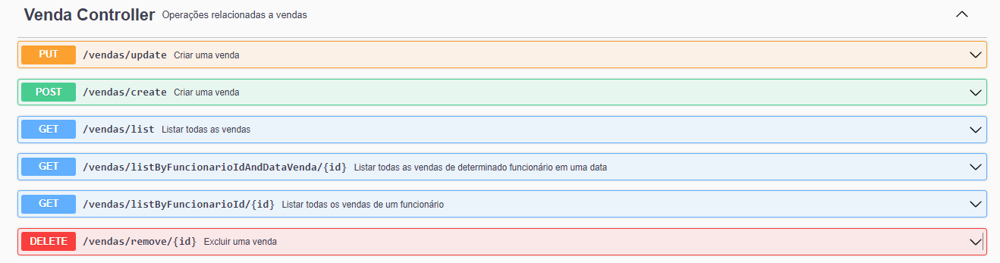
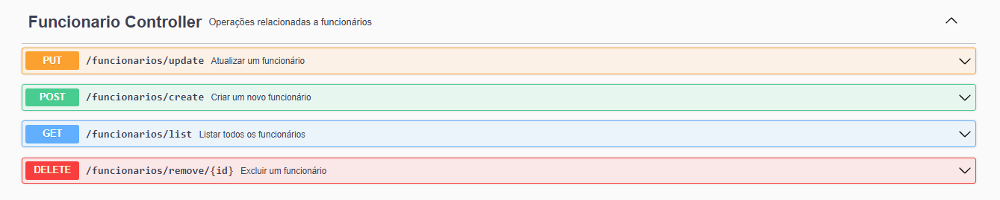

# FuncionariosAPI
API desenvolvida em Spring Boot para sistema de gerenciamento financeiro de Empresa.

API documentada com Swagger.

Após executar a aplicação é possível ver e testar os Endpoints da API no endereço:
- http://localhost:8080/swagger-ui/index.html#/

## Requirements
 - Maven
 - Spring Boot
 - Java 17

## Endpoints

- Relatórios e filtros financeiros
  

- Operações relacionadas a cargos

  
- Operações relacionadas a vendas

- Operações relacionadas a funcionários

