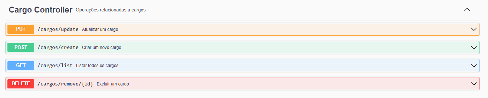

# FuncionariosAPI
API desenvolvida em Spring Boot para sistema de gerenciamento financeiro de Empresa.

API documentada com Swagger.

Após executar a aplicação é possível ver e testar os Endpoints da API no endereço:
- http://localhost:8080/swagger-ui/index.html#/

## Requirements
 - Maven
 - Spring Boot
 - Java 17
 - MySQL

## Endpoints

- Relatórios e filtros financeiros
  


- Operações relacionadas a cargos


  
- Operações relacionadas a vendas


- Operações relacionadas a funcionários


# Scripts SQL

## Tabela Cargo

```sql

-- Inserir dados para o cargo de Secretário
INSERT INTO funcionariosapi.cargo (nome, salario_base, beneficio_anual, beneficio_percentual)
VALUES ('Secretário', 7000.00, 1000.00, 20.00);

-- Inserir dados para o cargo de Vendedor
INSERT INTO funcionariosapi.cargo (nome, salario_base, beneficio_anual, beneficio_percentual)
VALUES ('Vendedor', 12000.00, 1800.00, 30.00);

-- Inserir dados para o cargo de Gerente
INSERT INTO funcionariosapi.cargo (nome, salario_base, beneficio_anual, beneficio_percentual)
VALUES ('Gerente', 20000.00, 3000.00, 0.00);


```
## Tabela Funcionario

```sql
INSERT INTO funcionariosapi.funcionario (data_contratacao, nome, cargo_id) VALUES
('2018-01-01', 'Jorge Carvalho', (SELECT id FROM cargo WHERE nome = 'Secretário')),
('2015-12-01', 'Maria Souza', (SELECT id FROM cargo WHERE nome = 'Secretário')),
('2021-12-01', 'Ana Silva', (SELECT id FROM cargo WHERE nome = 'Vendedor')),
('2021-12-01', 'João Mendes', (SELECT id FROM cargo WHERE nome = 'Vendedor')),
('2017-07-01', 'Juliana Alves', (SELECT id FROM cargo WHERE nome = 'Gerente')),
('2014-03-01', 'Bento Albino', (SELECT id FROM cargo WHERE nome = 'Gerente'));
```
## Tabela Venda

```sql

INSERT INTO venda (data_venda, valor, funcionario_id) VALUES
-- Vendas da Ana Silva
('2021-12-01', 5200.00, (SELECT id FROM funcionario WHERE nome = 'Ana Silva')),
('2022-01-01', 4000.00, (SELECT id FROM funcionario WHERE nome = 'Ana Silva')),
('2022-02-01', 4200.00, (SELECT id FROM funcionario WHERE nome = 'Ana Silva')),
('2022-03-01', 5850.00, (SELECT id FROM funcionario WHERE nome = 'Ana Silva')),
('2022-04-01', 7000.00, (SELECT id FROM funcionario WHERE nome = 'Ana Silva')),
-- Vendas do João Mendes
('2021-12-01', 3400.00, (SELECT id FROM funcionario WHERE nome = 'João Mendes')),
('2022-01-01', 7700.00, (SELECT id FROM funcionario WHERE nome = 'João Mendes')),
('2022-02-01', 5000.00, (SELECT id FROM funcionario WHERE nome = 'João Mendes')),
('2022-03-01', 5900.00, (SELECT id FROM funcionario WHERE nome = 'João Mendes')),
('2022-04-01', 6500.00, (SELECT id FROM funcionario WHERE nome = 'João Mendes'));
```


